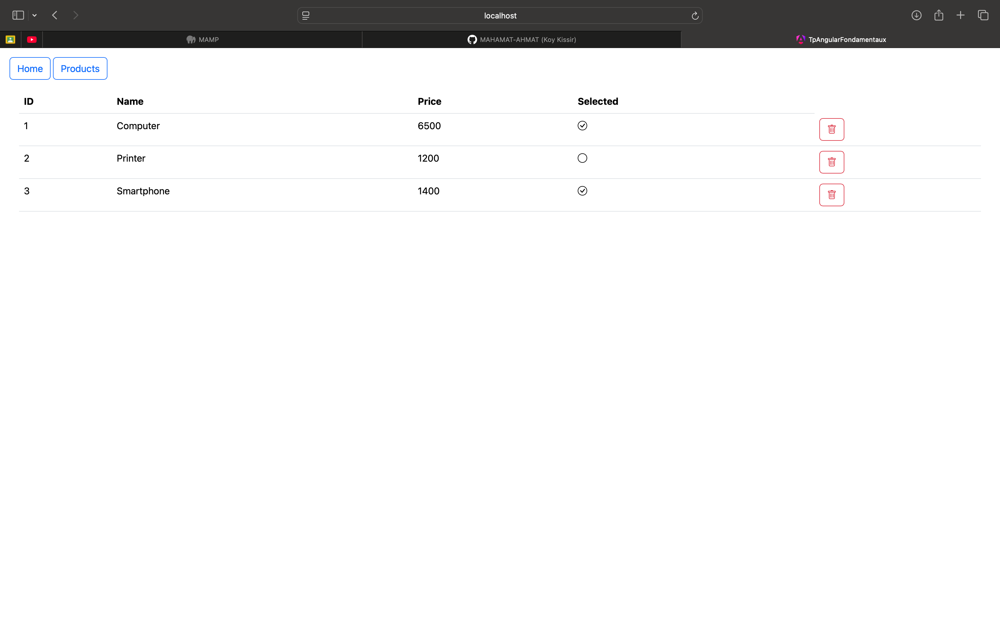
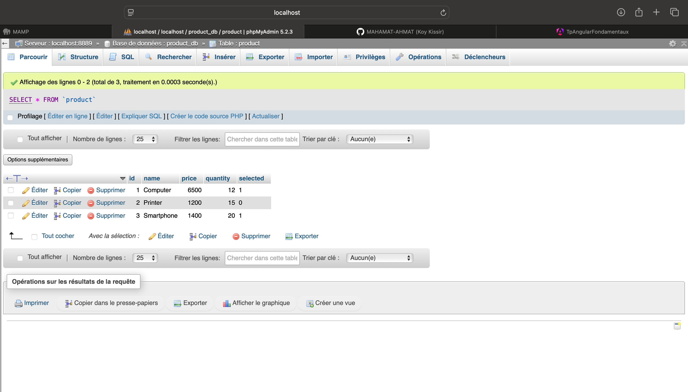

# Projet TP — Angular + Spring Boot + MySQL (MAMP)

Ce projet est une mini application **full-stack** qui affiche une liste de produits via une API **Spring Boot** et une base **MySQL** (gérée avec **MAMP / phpMyAdmin**), consommée côté **Angular**.

### 1) Interface Angular (Products)
- Menu : **Home** / **Products**
- Tableau produits avec colonnes : **ID**, **Name**, **Price**, **Selected**
- Actions : bouton **Supprimer** (icône poubelle) pour chaque ligne
- Exemples visibles : *Computer*, *Printer*, *Smartphone* avec des états `selected` différents.

<!-- Images (dossier: images/) -->

  

### 2) Base de données MySQL (phpMyAdmin)
- Serveur : **localhost (MAMP)**
- Base : **product_db**
- Table : **product**
- Colonnes visibles : `id`, `name`, `price`, `quantity`, `selected`
- 3 produits présents (Computer, Printer, Smartphone)

  

## Fonctionnement général
- **Angular** récupère les produits depuis l’API et les affiche dans un tableau.
- **Spring Boot** fournit les endpoints REST pour lire/supprimer des produits.
- **MySQL** stocke les données des produits (consultables/modifiables via phpMyAdmin).

## Fonctionnalités réalisées
- Affichage de la liste des produits
- Affichage du statut `selected`
- Suppression d’un produit depuis l’interface (action delete)
- Données persistées dans MySQL

## Auteur
MAHAMAT-AHMAT TIMAN
